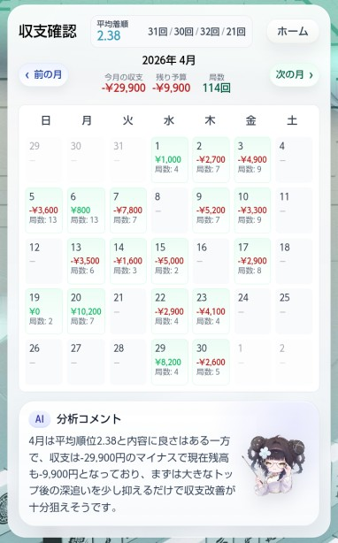

## Laravel ver13のAI機能で遊んでた話

---

### なんかver13からAIがでるらしい!!(よー知らんけど)

</br>

- 完全にAIに乗り遅れている自分にもってこい!
- これ使ったら勝手にコーディングとかしてくれるんとちゃうか!(知らんけど)
- どっから使用料でんねやろ、コミュニティの募金とかなんかな...(知らんけど)

---

### ひとまずDocumentに沿ってインストール

- 適当にデータつくって、`agent()`に投げればえーねんな

```
$prompt = <<<PROMPT
    以下のデータを分析してください。

    【データ】
    {$data}
    PROMPT;

$ai_comment = (string) agent(instructions: $instructions)->prompt($prompt);

```

---

### Code: 401

</br>

```

HTTP request returned status code 401:
{
    "error": {
    "message": "Incorrect API key provided:
    {"userId":1,"exception":"[object] (Illuminate\\Http\\Client\\RequestException(code: 401): HTTP request returned status code 401:
        )}
    }
}

```

...`API key`が正しくない...?そんなもん持ってませんけど

---

## ちゃんと調べてみると

</br>

- AI SDKはただのラッパーでAIとは別契約
- 契約したAIサービスのキーを登録すればAPIリクエストしてくれる

　=> 仕方なしでOpenAIにアカウント作成

---

### 使ってみた感想

</br>



###### DBのデータをプロンプトに投げて分析

- レスポンスがめっちゃ遅い!!
  - バッチ + DB
  - レスポンスを非同期
- リクエスト数課金なのでキャッシュを活用したい

---

## promptいじるの楽しい

`ドSの女王`


`ローマのお姫様`

