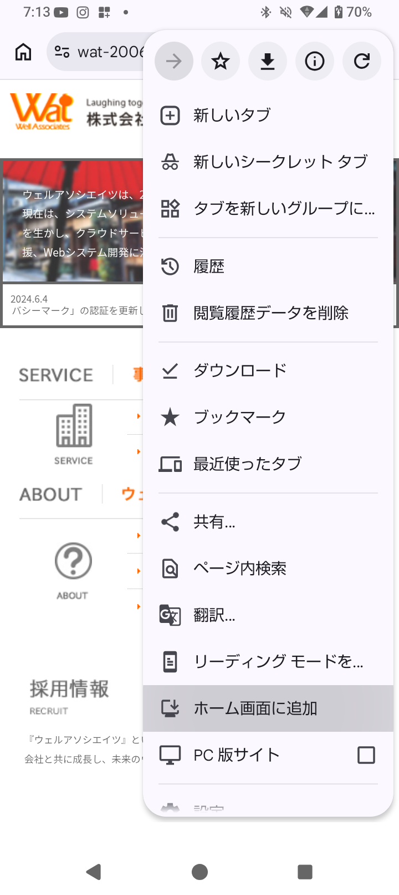
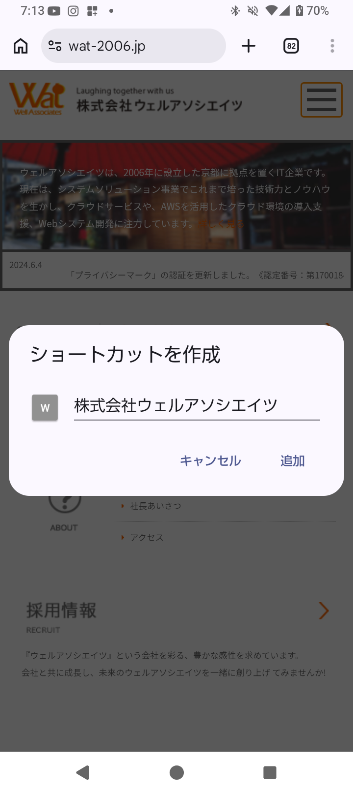
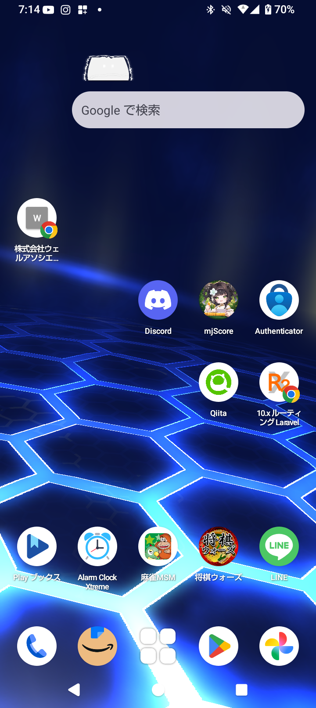
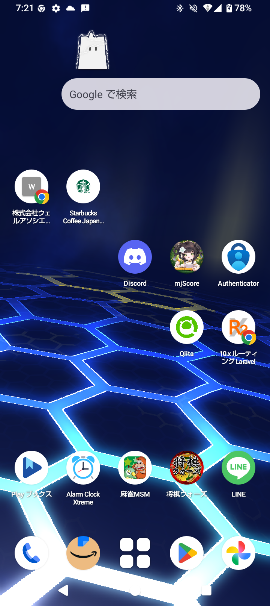
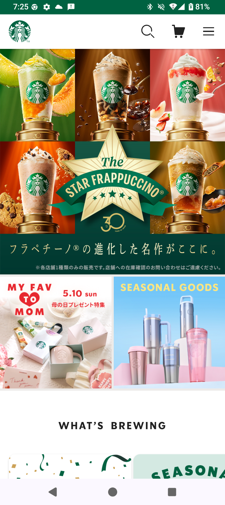

# PWA化が思ったより簡単だった

### PWA（Progressive Web App）とは？

- Webサイトをアプリっぽくつかえるやつ

---

### よく見るサイトをホーム画面に追加したいとき







---

### PWAを使うと....




---

### メリット

- アプリ感がある
  - URLバーの表示を消せる
  - アイコンを変えられる
- 審査がいらない
- キャッシュ周りをより扱えるようになりそう...(雰囲気だけ)
  

---

### 導入

1. composerでpwaツールのインストール
   `vite-plugin-pwa`
2. `vite.config.ts`ファイルを修正
3. buildすれば終了!簡単!!

[参考記事](https://zenn.dev/shota_karato/articles/cb25b625ced6fb)

---

#### 一例

```
  manifest: {
        name: "MJ Score",
        short_name: "MJ Score",
        description: "麻雀の収支・成績を管理できるアプリ",
        theme_color: "#0f172a",
        background_color: "#ffffff",
        display: "standalone",
        orientation: "portrait",
        scope: "/",
        start_url: "/",
        icons: [
          {
            src: "/pwa-192x192.png",
            sizes: "192x192",
            type: "image/png",
          },
          {
            src: "/pwa-512x512.png",
            sizes: "512x512",
            type: "image/png",
          },
          {
            src: "/pwa-512x512.png",
            sizes: "512x512",
            type: "image/png",
            purpose: "any maskable",
          },
        ],
      },
```
