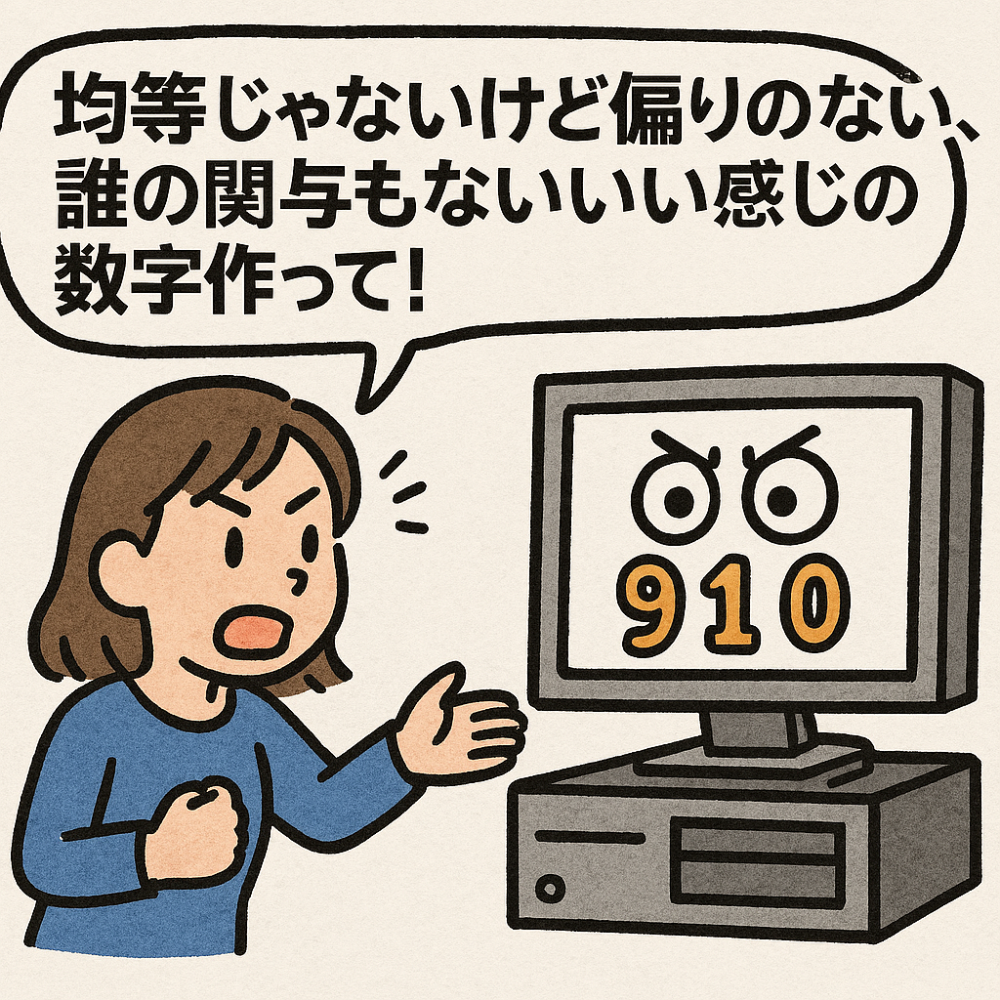
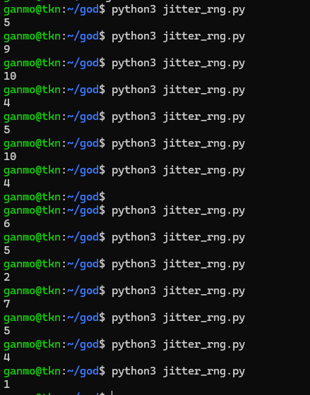
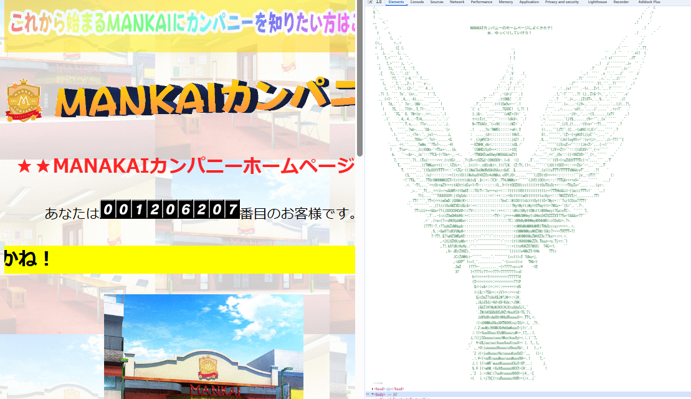

# 神はサイコロを振らない
<br>
<br>

## 物事は偶然任せではなく因果や法則で成り立っている

---
# なので結果だけ神様に聞いてみよう
---
## 乱数生成
- 意外と難しい
    - コンピュータは正しい計算をさせるのは優れているが、"無からランダムに"は難しい。
    - シンプルにそんなコード書けない。



---
## 乱数生成の種類
- 真性乱数
    - 物理現象の非決定論的揺らぎを直接測定
       - 熱雑音・放射線・クロックジッタ等
- 擬似乱数
    - アルゴリズムにを渡す
        - 初期シード


---
## クロックジッタを実際に計測して作ってみた
1. cpuにアクセスを繰り返して短期間で軽い負荷を与える
2. その前後の時刻差を取得
3. 統計処理
    - ハッシュ化(ホワイトニング)
    - 拒否サンプリング
4. 結果を1~10にマッピング



---
## ソースコード

<style>
pre {
  max-height: 400px;
  overflow-y: auto;
}
</style>

```python
import time
import hashlib
import sys

## サンプル数 256
## アクセス回数 50
def collect_timing_bytes(samples=256, busy=50):
    buf = bytearray()
    for _ in range(samples):
        t0 = time.perf_counter_ns()
        for i in range(busy):
            _ = i * i
        t1 = time.perf_counter_ns()
        delta = (t1 - t0) & 0xFFFFFFFFFFFFFFFF
        buf += delta.to_bytes(8, 'little')
    return bytes(buf)

def hash_to_u32(data):
    h = hashlib.sha256(data).digest()
    return int.from_bytes(h[:4], 'little')

def to_1_10(u32):
    MOD = 10
    MAX32 = 1 << 32
    limit = (MAX32 // MOD) * MOD
    if u32 >= limit:
        return None
    return (u32 % MOD) + 1

def generate_one():
    while True:
        raw = collect_timing_bytes()
        u = hash_to_u32(raw)
        v = to_1_10(u)
        if v is not None:
            return v

def main():
    count = 1
    if len(sys.argv) > 1:
        try:
            count = max(1, int(sys.argv[1]))
        except ValueError:
            pass
    for _ in range(count):
        print(generate_one())

if __name__ == "__main__":
    main()
```
---

PS: WatのHPにも隠れアスキーアート欲しいなって
